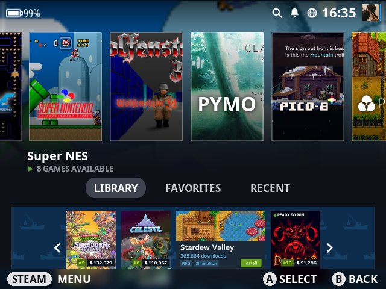
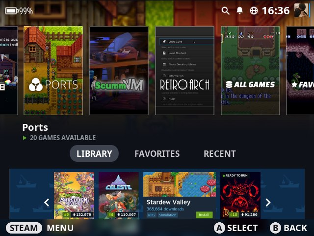
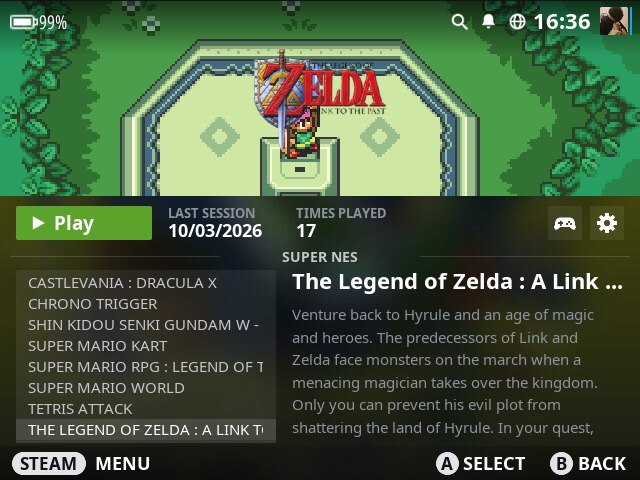
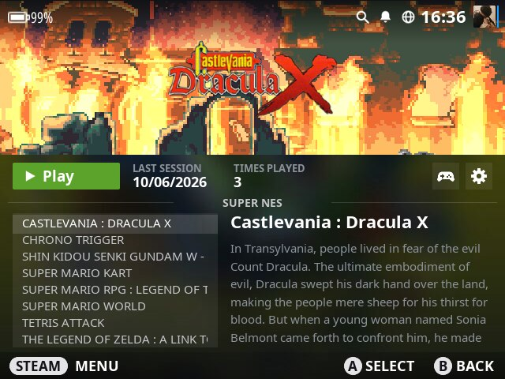
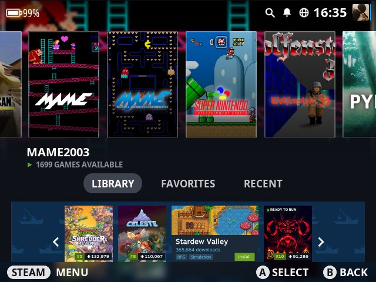
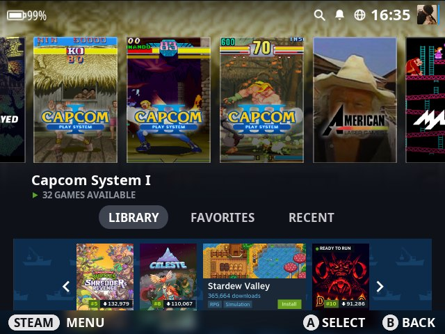
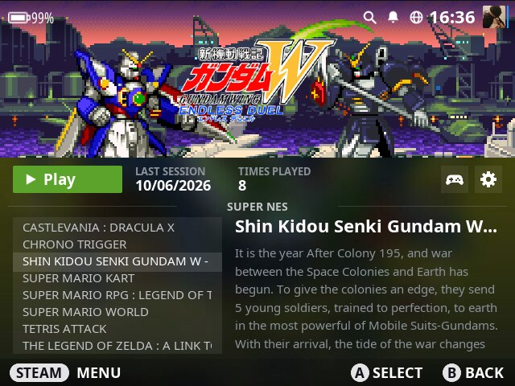

# es-theme-steamdeck

[EN](README.md) · **BR**

Tema no estilo do Steam Deck para o **EmulationStation-fcamod** no **R36S** e clones (família ArkOS, 640×480), com dois extras opcionais: **vídeo de boot** e **UI Fixes** (carrossel opaco e sons extras).

<p align="center">
   <br>
   
</p>

[Instalação](#instalação) · [Tema](#o-tema) · [Vídeo de boot](#vídeo-de-boot) · [UI Fixes](#steam-deck-ui-fixes) · [Compatibilidade](#compatibilidade) · [Personalizar](#personalizar)

## Instalação

As pastas espelham o cartão SD: copie cada uma para a sua partição.

```
BOOT/        partição de boot   boot.mp4 (seu vídeo), logo.bmp
EASYROMS/    partição de jogos  themes/es-theme-steamdeck, tools/*.sh
src/         código-fonte do instalador do UI Fixes
images/      screenshots usadas neste README
```

1. Copie `EASYROMS/themes/es-theme-steamdeck` para `/roms/themes/` (ou `/easyroms/themes/`).
2. **START → Configurações de interface → Tema → es-theme-steamdeck**. Escuro/claro fica no mesmo menu.
3. Extras opcionais: copie os scripts de `EASYROMS/tools` para a pasta de tools e rode em **Opções → Tools**.

## O tema

- Uma **capa vertical de mesmo tamanho** por sistema (192×288, 2:3, como na biblioteca da Steam): screenshot do jogo mais conhecido da plataforma, a logo do próprio sistema e um contorno fino. 310 sistemas mais as 3 coleções têm uma. Os 21 sem screenshot em lugar nenhum (computadores obscuros e homebrew) usam o cartão cinza da Steam com a logo.
- A capa selecionada é o fundo da página, desfocada e se misturando à cor da página. A lista de jogos segue a página de jogo do Deck: imagem no topo, PLAY, última sessão, vezes jogado, lista e descrição.
- Esquemas escuro e claro. Por enquanto o tema é focado no **R36S, 4:3 (640×480)**; outras proporções de tela estão planejadas e chegam em breve.
- **27 idiomas** (os mesmos do tema XMB): rodapé, abas, rótulos, datas e o banner do PortMaster.
- Sons da interface do Steam Deck. A navegação toca em qualquer ES; select/back/launch/favorite precisam do UI Fixes.

<p align="center">
    
</p>

## Vídeo de boot

`Enable Boot Video.sh` toca o `boot.mp4` (de `/boot` ou `/flash`) depois da logo de boot e antes do EmulationStation, e esconde os terminais do boot e o cursor de texto. `Disable Boot Video.sh` desfaz.

| Sistema | Método |
|---|---|
| ArkOS, arkos4clone, dArkOSen, dArkOSRE-R36 | serviço systemd `bootvideo.service`; o `boot.ini` recebe `vt.color=0x00 vt.global_cursor_default=0` (backup `boot.ini.bak-bootvideo`); a tela "Welcome to…" dos clones do lcdyk é pulada enquanto o vídeo existir. O `ffmpeg` decodifica direto para o `/dev/fb0` (sem janela, sem cursor do mouse), com `ffplay`/`mpv` de reserva |

O script também tem código para outros sistemas, mas só os da tabela de compatibilidade abaixo estão confirmados. Dica: 640×480, H.264, poucos segundos.

## Steam Deck UI Fixes

O ES dessa família desenha os itens não selecionados do carrossel com 50% de opacidade fixa e ignora a maioria dos sons do tema. `Enable Steam Deck UI Fixes.sh` instala um ES com patch que acrescenta `unselectedOpacity` ao `<carousel>` (o tema usa `1`), toca os sons `select`, `back`, `favorite` e `quicksysselect` e mostra uma logo pequena na tela de carregamento. `Disable Steam Deck UI Fixes.sh` restaura o original (guardado como `emulationstation.orig-xmbsounds`).

⚠️ Build de teste: **sem scraper embutido** (essas credenciais só existem no build oficial), e uma atualização do arkos4clone troca o ES de novo (é só rodar outra vez). O script confere arquitetura e bibliotecas antes e não altera nada se não baterem. Sem ele o tema funciona igual, com as capas a 50% e só o som de navegação.

<details><summary>Compilar do código-fonte</summary>

Código: `src/ui-fixes` (patches para o [lcdyk0517/EmulationStation-fcamod](https://github.com/lcdyk0517/EmulationStation-fcamod), branch `dev`). Precisa de Docker.

```bash
git clone --recursive --depth 1 -b dev https://github.com/lcdyk0517/EmulationStation-fcamod.git EmulationStation-fcamod-lcdyk
git -C EmulationStation-fcamod-lcdyk apply ../src/ui-fixes/xmb-sounds.patch ../src/ui-fixes/carousel-opacity.patch
bash src/ui-fixes/build.sh   # container Debian 10 arm64 (glibc antiga), ~10-15 min
bash src/ui-fixes/pack.sh    # binário + install-template.sh -> Enable Steam Deck UI Fixes.sh
```
Ajuste os caminhos nos scripts se mudar as pastas.
</details>

## Compatibilidade

| | Tema | Vídeo de boot | UI Fixes |
|---|---|---|---|
| ArkOS | ✅ | ✅ | ✅ |
| arkos4clone | ✅ | ✅ | ✅ |
| dArkOSen | ✅ | ✅ | ✅ |
| dArkOSRE-R36 | ✅ | ✅ | ✅ |
| dArkOS | ✅ | ❌ não funciona | ✅ |
| muOS | ❌ não funciona | – | – |
| ArchR, Batocera, Knulli, EmuELEC | ainda não testado | ainda não testado | ainda não testado |

Outros limites: só 640×480 (4:3) por enquanto, outras proporções chegam em breve; abas, pílula STEAM e banner são decorativos; algumas screenshots são fracas (Lynx, Kodi); o esquema claro foi menos testado que o escuro.

## Personalizar

Os arquivos têm o nome da entrada `<theme>` do sistema no `es_systems.cfg` (ex.: `snes`, `megadrive`), não o da pasta de ROMs. Todos os caminhos ficam dentro de `_inc/`.

| O quê | Onde | Tamanho |
|---|---|---|
| Capa | `systems/capsule/<theme>.png` | 192×288 (2:3, maior também serve) |
| Fundo da lista de jogos (escuro / claro) | `systems/gl/` · `gl-light/` | 640×480 |
| Parte sob a imagem do jogo | `systems/glinfo/` · `glinfo-light/` | 640×284 |
| Banner (todos os sistemas, por idioma) | `images/banner-portmaster[-<lang>].png` | 1202×274 |
| Banner (um sistema) | `systems/banner/<theme>.png` | 1202×274 |
| Avatar | `images/avatar.png` | 96×96 |
| Cores | `colors/dark.xml`, `light.xml` | |
| Traduções | `lang/<code>.xml` | |

Para trocar uma capa cinza, coloque seu PNG com o nome do sistema em `systems/capsule/`. O layout está em `aspect-ratio-4-3.xml`; os textos em inglês são as `variables` no início do `theme.xml` (o fcamod para de ler blocos `variables` no primeiro de outro idioma, por isso cada tradução é um arquivo próprio).

## Créditos e licença

**Testes:** [Sabrina Broch](https://www.youtube.com/@sabrinabroch1/videos) testou o tema, o vídeo de boot e o UI Fixes nos sistemas marcados com ✅ acima. Obrigado!

**Licença:** [CC BY-NC 4.0](LICENSE)
